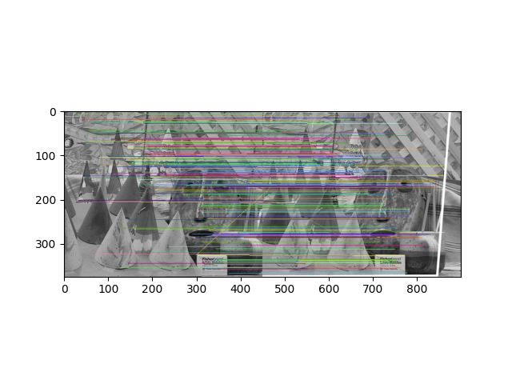
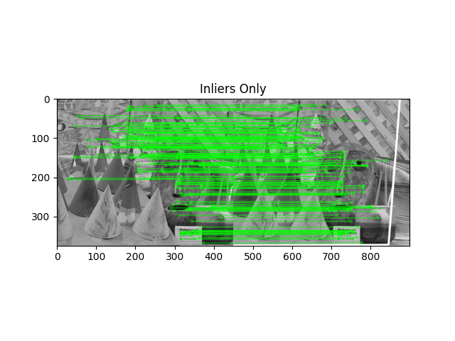
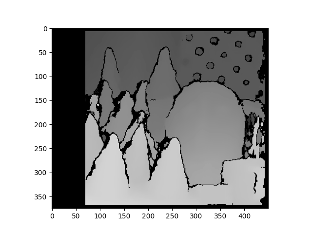

# Stereo Vision: SIFT Keypoint Matching and Homography

This script demonstrates the use of SIFT (Scale-Invariant Feature Transform) for feature detection and matching between two images. It includes the application of the FLANN (Fast Library for Approximate Nearest Neighbors) matcher, Lowe's ratio test for quality match selection, homography estimation, and drawing of results.

## Prerequisites

To run this script, you will need Python installed along with the following libraries:
- OpenCV (`cv2`)
- NumPy (`numpy`)
- Matplotlib (`matplotlib`)
- Logging (`logging`)

You can install the required packages using pip:
```bash
pip install opencv-python numpy matplotlib
```
## Usage
- Place the images you want to compare in a folder named example_1/input/ with filenames ```image1.jpeg``` and ```image2.jpeg```
- Run the script using Python. Ensure you are in the directory containing the script, or add the script's path to the command:
```
python sift_keypoint_matching.py
```

## Features
- **SIFT Keypoint Detection:** Identifies keypoints in each image using SIFT.
- **Keypoint Matching:** Matches keypoints using FLANN with Lowe's ratio test to filter good matches.
- **Homography Estimation:** Estimates a transformation matrix between matched keypoints if the number of good matches exceeds a minimum count.
- **Visualization:** Outputs visualizations showing the matched keypoints, the effect of homography, and a disparity map.

## Outputs

The script will display three main visual outputs if the matching criteria are met:

1. An image showing keypoints matched between the two images.
   
2. An image showing the transformation (homography) applied to locate one image in the other.
   
3. A disparity map indicating depth perception between the two images.
   

## Notes

- The script assumes grayscale input for simplicity in processing.
- Ensure that the images are sufficiently similar to obtain meaningful matches and homography.

## Troubleshooting

- **Not Enough Matches Found**: This might occur if the images do not contain enough similar features or are very different. Try with images that have more texture or distinct features.
- **Module Not Found Errors**: Ensure all dependencies are correctly installed. Re-run the installation commands if necessary.
